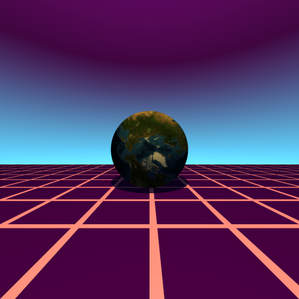

# Backward Ray Tracer Implementation
Implemented a backward ray tracer using C++ and CMake. The project models a perspective camera with a single point light source, and renders one sphere with an Earth texture. It uses the Blinn-Phong illumination model for lighting and shading. Anti-aliasing and texture mapping was also added.

Download the Repo and open raytrace.exe to see the image. (FYI - It needs all the ddl files and the R3.png to render the image.)

